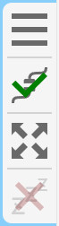
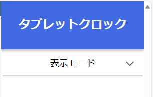

Language: 　**English**　|　[日本語](./README_jp.md)

# TabletClock
This web-based system transforms your unused tablet devices into used table clocks.


## Background
When I cleaned up on my desk and I found that I made more free space than I expected on it. Then, I thought that I put something like [Google Nest Hub](https://store.google.com/product/nest_hub_2nd_gen) and saw its product page. However, I realized that its functions are not enough for me (I want to know the temperature and humidity in my room), and I came to want to make a similar system by my self.

Instead of Google Nest Hub, I considered that I get a small display device (with touch function) and show the screen from [Raspberry Pi](https://www.raspberrypi.com/). However, I thought that it was expensive to purchase a new display device just to show the clock. After thinking about it a lot, I remembered that I have a tablet device that I don't use very often (at home) and decided to create this system to make it more effective.

## Features
### Already implemented
- Shows current date and time.
- Shows temperature and humidity from sensors.
  - Shows temperature and humidity changes over the last 24 hours with line graph.
  - Shows current discomfort index.
- Supports dark mode.
  - Changes light or dark mode depending on current brightness.

### Plan to be implemented
- Shows current wether and wether forecast.
- Shows upcoming schedules from [Google Calendar](https://calendar.google.com).
- Changes the background into your favorite images.

## Things needed
- [Raspberry Pi 4](https://www.raspberrypi.com/products/raspberry-pi-4-model-b/) x1
  - (Works on older Raspberry Pi, but newer ones are more stable.)
  - [AHT21B (temperature and humidity sensor)](https://akizukidenshi.com/catalog/g/gK-17394/) x1
  - [MCP3208-CI/P (A/D converter)](https://akizukidenshi.com/catalog/g/gI-00238/) x1
  - [CdS cell (brightness sensor)](https://akizukidenshi.com/catalog/g/gI-00110/) x1
  - [10kΩ resistor](https://akizukidenshi.com/catalog/g/gR-25103/) x1
  - Circuit board ([bread board](https://akizukidenshi.com/catalog/g/gP-05294/), [universal circuit board](https://akizukidenshi.com/catalog/g/gP-03229/), etc.)
  - Wire ([jumper wire](https://akizukidenshi.com/catalog/g/gC-05159/), etc.)
- A device to show clock
  - Recommended to use tablet devices.
  - For iPad, use [Safari](https://www.apple.com/safari/).
  - Cannot use iPhone (will not go to full screen).

## Schematic


## Setup
### Setup Raspberry Pi and circuit
1. Setup your Raspberry Pi. You need to make the bash shell (or other shells) available.
2. Make the circuit refer to the [schematic](#schematic).
2. Setup your Raspberry Pi.

### Setup the system
1. Install [Node.js](https://nodejs.org) by typing following commands on the shell (run one line at a time. `$` is not part of the commands).
   ```sh
   $ sudo apt update
   $ sudo apt install nodejs npm
   ```

2. Install Node.js version manager (n).
   ```sh
   $ sudo npm install n -g
   ```

3. Install Node.js v20.
   ```sh
   $ sudo n 20
   ```

From here, there are 2 ways to install.

#### A - The way to install from npm
4. Create a new directory for the system.
   ```sh
   $ mkdir TabletClock
   ```

5. Install the system.
   ```sh
   $ npm install @gakuto1112/tablet-clock
   ```

6. Run the system.
   ```sh
   $ npx tablet-clock
   ```

#### B - The way to install from this repository
4. Clone this repository.
   - If your Raspberry Pi doesn't have [Git](https://git-scm.com/) system, you need to install it.
   ```sh
   $ git clone https://github.com/Gakuto1112/TabletClockServer.git
   ```

5. Install dependencies of the system.
   ```sh
   $ npm install
   ```

6. Prepare source files of the system.
   ```sh
   $ cd ./src/shell/
   $ sh ./update_global_files.shell
   $ sh ./build.sh
   $ cd ../../
   ```

7. Run the system.
   ```sh
   $ npm start
   ```

---

8. After running the system, you can access the tablet clock page on your browser at `http://<system_local_ip>:5000`.

## How to use
### The side tab
The side tab will be appeared when you tap on the background. It will be closed automatically when you don't touch it for a while.



There are four buttons in it.

#### 1 - Open/Close hamburger menu button
Opens/Closes [hamburger menu](#the-hamburger-menu).

#### 2 - Connect/Disconnect server button
Connects/Disconnects the server. When the client is connecting to the server, a check mark (✓) will be appeared. The client will try to connect to the server when loading the page, so you don't have to click this button every time when loading the page.

#### 3 - Enter/Exit full screen button
Enters/Exits full screen mode. It will be appeared in translucent if your device or browser doesn't support full screen mode.

#### 4 - Enter/Exit keep awake button
Enters/Exits keep awake mode. The clock can prevent your device from entering sleep when it enabled. It will be appeared in translucent if your device or browser doesn't support full screen mode, or you use `http` scheme (not `https`).

### The hamburger menu
The hamburger menu will appeared when you click [open/close hamburger menu button](#1---openclose-hamburger-menu-button). You can change settings of the tablet clock page from here. These settings are stored in your device and applied to the your device only.



#### Display mode
Changes the display mode (light mode or dark mode). There are four options.

##### Light mode
Always uses light mode.

##### Dark mode
Always uses dark mode.

##### System auto
Uses light mode or dark mode depending on the display mode of your os/browser.

##### Sensor auto
Uses light mode or dark mode depending on the sensor output.