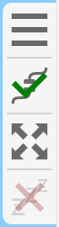
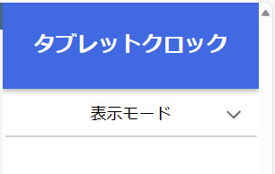

言語：　[English](./README.md)　|　**日本語**

# TabletClock
使用していないタブレットを便利な置時計にするWebアプリを提供する、Raspberry Pi上で動作させる事を想定したWebサーバーです。

（メイン画像は準備中です。）

## 経緯
机上を整理していたら思ったよりもスペースができ、ここに何かを置こうかと考えたところ、[Google Nest Hub](https://store.google.com/jp/product/nest_hub_2nd_gen)のようなものを置いてみてはどうだろうかと思い、商品ページ等を見て検討していました。しかし、Google Nest Hubの機能に過不足を感じる（部屋の温度と湿度の表示が欲しかった）上、自分でもそれっぽいものを作ってみたいという思いがありました。

そこで、代わりに（タッチ機能付きの）小型ディスプレイを置いてそこに[Raspberry Pi]((https://www.raspberrypi.com/))からインターフェースを表示させるという方法を検討しましたが、時計を表示させるためだけにディスプレイを新たに購入するのは高いと感じていました。それからも色々考えていたところ、ふと、（家では）あまり使用していないタブレットがある事を思い出し、これを有効活用すべく、これを作成する事になりました。

## 機能
### 実装済み
- 現在の日時を表示します。
- センサーから取得した現在の温度と湿度が表示します。
  - 過去24時間分の温度と湿度の変化を折れ線グラフで表示します。
  - 現在の[不快指数](https://ja.wikipedia.org/wiki/不快指数)を表示します。
- ダークモードに対応しています。
  - 現在の明るさに応じてライトモードとダークモードを切り替えます。

### 実装予定
- 現在の天気と天気予報を表示します。
- [Googleカレンダー](https://calendar.google.com)から今後の予定を表示します。
- 背景をお好みの画像に変更できます。

## 必要なもの
- [Raspberry Pi 4](https://www.raspberrypi.org/) x1
  - （過去のRaspberry Piでも動作しますが、新しいものの方がより動作が安定します。）
  - [AHT21B（温湿度センサー）](https://akizukidenshi.com/catalog/g/gK-17394/) x1
  - [MCP3208-CI/P（ADコンバータ）](https://akizukidenshi.com/catalog/g/gI-00238/) x1
  - [CdSセル（明るさセンサー）](https://akizukidenshi.com/catalog/g/gI-00110/) x1
  - [10kΩ抵抗器](https://akizukidenshi.com/catalog/g/gR-25103/) x1
  - 回路基板（[ブレッドボード](https://akizukidenshi.com/catalog/g/gP-05294/)、[ユニバーサル基板](https://akizukidenshi.com/catalog/g/gP-03229/)等）
  - ワイヤー（[ジャンパーワイヤー]((https://akizukidenshi.com/catalog/g/gC-05159/))等）
- 置時計デバイス
  - タブレット端末が推奨です。
  - iPadの場合はSafariを使用して下さい。
  - iPhoneは使用できません（フルスクリーンに移行しません）。

## 回路図


## セットアップ
### Raspberry Piと回路のセットアップ
1. Raspberry Piをセットアップします。bashシェル（他のシェルも可）が使えるようにして下さい。
2. [回路図](#回路図)を参考に、回路を組んでください。

### システムのセットアップ
1. 以下のコマンドをシェルに入力して、[Node.js](https://nodejs.org)をインストールします（`$`はコマンドではありません）。
   ```sh
   $ sudo apt update
   $ sudo apt install nodejs npm
   ```

2. Node.jsのバージョン管理システム（n）をインストールします。
   ```sh
   $ sudo npm install n -g
   ```

3. Node.js v20をインストールします。
   ```sh
   $ sudo n 20
   ```

ここからは2通りのセットアップ方法があります。

#### A - npmからインストールする方法
4. システム用の新規ディレクトリを作成します。
   ```sh
   $ mkdir TabletClock
   ```

5. システムをインストールします。
   ```sh
   $ npm install @gakuto1112/tablet-clock
   ```

6. システムを実行します。
   ```sh
   $ npx tablet-clock
   ```

#### B - このレポジトリからインストールする方法
4. このレポジトリをクローンします。
   - お手持ちのRaspberry Piに[Git](https://git-scm.com/)インストールされていない場合は、インストールして下さい。
   ```sh
   $ git clone https://github.com/Gakuto1112/TabletClockServer.git
   ```

5. システムの依存パッケージをインストールします。
   ```sh
   $ npm install
   ```

6. システムのソースファイルを準備します。
   - 2つ目のコマンドを実行する際にエラーが表示される場合がありますが、問題ありません。
   ```sh
   $ cd ./src/npm
   $ ../../node_modules/.bin/tsc
   $ cd ../../
   $ npm run build
   ```

7. システムを実行します。
   ```sh
   $ npm start
   ```

---

8. システム実行後、ブラウザで`http://<システムのローカルip>:5000`からタブレットクロックのページにアクセスできます。

## 使用方法
### サイドタブ
背景をタップするとサイドタブが表示されます。これは、暫くタップされないと自動的に閉じます。



サイドには4つのボタンがあります。

#### 1 - ハンバーガーメニュー開閉ボタン
[ハンバーガーメニュー](#ハンバーガーメニュー)を開閉します。

#### 2 - サーバー接続/切断ボタン
サーバーに接続/切断します。クライアントがサーバーと接続されている場合はチェックマーク（✓）が表示されます。ページ表示に自動的にサーバーとの接続を試行するため、ページが表示されるごとに手動で押す必要はありません。

#### 3 - フルスクリーンモード開始/終了ボタン
フルスクリーンモードを開始/終了します。デバイスやブラウザがフルスクリーンモードに対応していない場合は半透明で表示されます。

#### 4 - 起動ロックモード開始/終了ボタン
起動ロックモードを開始/終了します。起動ロックモード中は、デバイスがスリープモードに移行するのを防げます。デバイスやブラウザが起動ロックモードに対応していない場合や`http`スキーム（`https`ではない）を使用している場合は半透明で表示されます。

### ハンバーガーメニュー
ハンバーガーメニューは[ハンバーガーメニュー開閉ボタン](#1---openclose-hamburger-menu-button)を押すと表示されます。タブレットクロックのページの設定をここで変更できます。これらの設定はデバイスに保持され、このデバイスでページを表示した時のみに適用されます。



#### 表示モード
表示モードを変更できます（ライトモードかダークモードか）。4つのオプションがあります。

##### ライトモード
常にライトモードを使用します。

##### ダークモード
常にダークモードを使用します。

##### システムに基づく
OS/ブラウザの表示モードに基づき、ライトモードとダークモードを切り替えます。

##### センサーに基づく
センサー出力に基づき、ライトモードとダークモードを切り替えます。