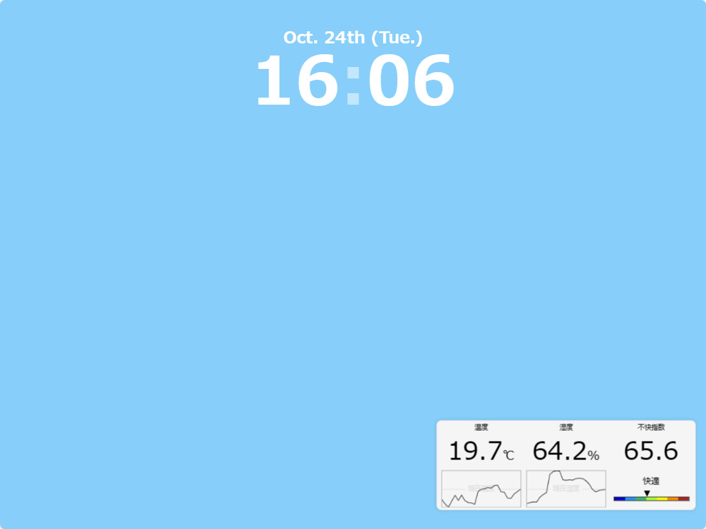

言語：　[English](./README.md)　|　**日本語**

# TabletClockServer
使用していないタブレットを便利な置時計にするWebアプリを提供する、Raspberry Pi上で動作させる事を想定したWebサーバーです。

## 経緯
机上を整理していたら思ったよりもスペースができ、ここに何かを置こうかと考えたところ、[Google Nest Hub](https://store.google.com/jp/product/nest_hub_2nd_gen)のようなものを置いてみてはどうだろうかと思い、商品ページ等を見て検討していました。しかし、Google Nest Hubの機能に過不足を感じる（部屋の温度と湿度の表示が欲しかった）上、自分でもそれっぽいものを作ってみたいという思いがありました。そこで、代わりに（タッチ機能付きの）小型ディスプレイを置いてそこにRaspberry Piからインターフェースを表示させるという方法を検討しましたが、時計を表示させるためだけにディスプレイを新たに購入するのは高いと感じていました。それからも色々考えていたところ、ふと、（家では）あまり使用していないタブレットがある事を思い出し、これを有効活用すべく、これを作成する事になりました。

## 機能一覧
- 現在の日時を表示します。
- センサーから取得した温度、湿度が表示されます。
  - 現在の温度、湿度はグラフに横線としても表示されます。
- 過去24時間にセンサーから取得した温度、湿度がグラフで表示されます。
- MySQLによって1時間おきに取得された温度、湿度のデータが蓄積されます。
- 現在の天気と今後24時間の天気予報が表示されます（[Open-Meteo](https://open-meteo.com)）。
- 現在の時刻と天気を基に背景の色が変化します。
- 真っ暗に近い環境下では自動でダークモードが有効になり、光量が大きく押さえられます[^1]。

## 必要なもの
- [Raspberry Pi 4](https://www.raspberrypi.org/) x1
  - （過去のRaspberry Piでも動作しますが、新しいものの方がより動作が安定します。）
  - [AHT21B温湿度センサー](https://akizukidenshi.com/catalog/g/gK-17394/) x1
  - [MCP3208-CI/P ADコンバータ](https://akizukidenshi.com/catalog/g/gI-00238/) x1
  - [CdSセル](https://akizukidenshi.com/catalog/g/gI-00110/) x1
  - [10kΩ抵抗](https://akizukidenshi.com/catalog/g/gR-25103/) x1
- 置時計デバイス
  - タブレット端末が推奨です。
  - iPadの場合はSafariを使用して下さい。
  - iPhoneは使用できません（フルスクリーンに移行しません）。

## 回路図

## セットアップ
概要だけ説明します。詳しい手順は省きます[^2]。

1. [回路図](#回路図)を参考に、回路を組んでください。
2. Raspberry Piに[Node.js](https://nodejs.org/)と[MariaDB](https://mariadb.org/)（MySQLサーバー）をインストールします。
   - Node.jsは初期から入っているかと思います。必要に応じてNode.jsのアップデートを行ってください。
3. 必要に応じて、このアプリケーション専用のMySQLユーザを作成して下さい。
   - グローバルに`CREATE`、`tabletclock_temphumid.temp_humid`に`INSERT`と`SELECT`の権限を与えて下さい。
4. このレポジトリをクローンして下さい。
5. 作業ディレクトリをクロックしたレポジトリのルートに設定し、`npm install`を実行して必要なモジュール群をインストールして下さい。
6. 4.でダウンロードしたOAuthクライアントのjsonファイルを`credentials.json`に名前変更して、[./config/google_calendar/](./config/google_calendar/)に置いて下さい。
7. [各種設定ファイル](config/)を編集し、[設定](#設定)を行って下さい。
8. `ts-node TabletClockServer.ts`を実行してアプリケーションを実行して下さい。
   - `ts-node`が使用出来ない場合、`node_modules/.bin/ts-node TabletClockServer.ts`でも実行できます。
9. 置時計にするデバイスで`http://<サーバーのローカルip>:5000`にアクセスすると置時計のUIが表示されます。
   - サーバーと置時計デバイスは同じネットワークに接続して下さい。
   - 置時計デバイスの自動スリープを無効にするのがおすすめです。
10. 左上のフルスクリーンボタンを押してフルスクリーンに切り替えて下さい。
11. サーバーと切断した場合は、右上に再接続ボタンが表示されますので、押してサーバーと再接続して下さい。

## 設定
[./config/](config)に各種設定ファイルが置いてあります。

### database
データベースに関する設定です。

| 項目 | 説明 | 有効な値 | 初期値 |
| - | - | - | - |
| `mysqlUser` | アプリケーションで使用するユーザ名です。 | `string` | "" |
| `mysqlPassword` | `mysqlUser`のパスワードです。 | `string` | "" |

### sensors
センサーの値取得に関する設定です。

| 項目 | 説明 | 有効な値 | 初期値 |
| - | - | - | - |
| `busNumber` | 使用するI2Cのバス番号です。 | `number` 自然数 | 1 |
| `temperatureHumiditySensorInterval` | 温湿度のデータを更新する頻度です。単位は「秒」です。 | `number` 0以上の整数 | 15 |
| `brightnessSensorInterval` | 明るさのデータを更新する頻度です。単位は「秒」です。 | `number` 0以上の整数 | 5 |
| `darkModeThreshold` | ダークモードに切り替える、明るさの閾値です。値を上げるとより明るい環境でもダークモードに切り替わります。 | `number` 0 - 1 | 0.1 |

### weather_forecast
天気APIから取得する際に必要なパラメータです。

| 項目 | 説明 | 有効な値 | 初期値 |
| - | - | - | - |
| `latitude` | 天気を取得する地点の緯度です。 | `number` -90 - 90 | 35.68 |
| `longitude` | 気を取得する地点の経度です。 | `number` -180 - 180 | 139.77 |

- 初期値の地点は東京駅です。

## 気が向いたらやるコト
- 背景のフォトアルバム化
- 音楽プレイヤー
- アラーム
- （設定するものがあれば）設定画面

## クレジット
- アイコン：ICOOON MONO（[https://icooon-mono.com](https://icooon-mono.com)、一部改変を含みます）
- 天気予報API：Open Meteo（[https://open-meteo.com](https://open-meteo.com)）
- 回路図作成：diagrams.net（[https://www.diagrams.net](https://www.diagrams.net)）

[^1]: 光量の減り具合は使用する端末によって変化します。
[^2]: 今までやった作業を思い出しながら書いたので、もしかしたら抜けている工程があるかもしれません。