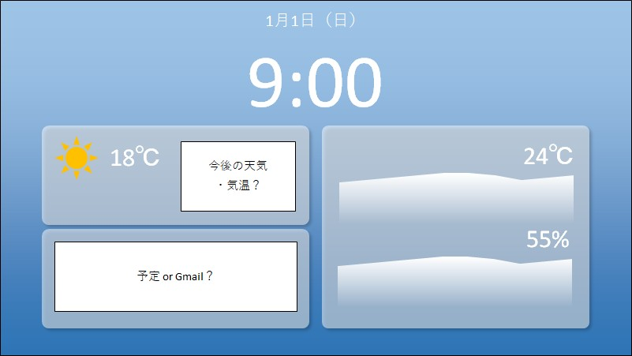

# TabletClockServer
使用していないタブレットを便利な置時計にするWebアプリを提供する、Raspberry Pi上で動作させる事を想定したWebサーバーです。

## 経緯
机上を整理していたら思ったよりもスペースができ、ここに何かを置こうかと考えたところ、[Google Nest Hub](https://store.google.com/jp/product/nest_hub_2nd_gen)のようなものを置いてみてはどうだろうかと思い、商品ページ等を見て検討していました。しかし、Google Nest Hubの機能に過不足を感じる（部屋の温度と湿度の表示が欲しかった）上、自分でもそれっぽいものを作ってみたいという思いがありました。そこで、代わりに（タッチ機能付きの）小型ディスプレイを置いてそこにRaspberry Piからインターフェースを表示させるという方法を検討しましたが、時計を表示させるためだけにディスプレイを新たに購入するのは高いと感じていました。それからも色々考えていたところ、ふと、（家では）あまり使用していないタブレットがある事を思い出し、これを有効活用すべく、これを作成する事になりました。

## 実装する機能
### 必ず実装したい機能
- [ ] 日付表示
- [ ] 時刻表示
- [ ] 部屋の温度表示
- [ ] 過去（1日くらい）の温度のグラフ表示
- [ ] 部屋の湿度表示
- [ ] 過去（1日くらい）の湿度のグラフ表示
- [ ] 過去の温度、湿度の蓄積（多分意味ないと思うけど）
- [ ] 天気の表示
- [ ] 予定かGmailの表示？
- [ ] 天気・時間によって変化するグラデーションな背景

### 気が向いたら実装したい機能
- [ ] 背景のフォトアルバム化
- [ ] 音楽プレイヤー
- [ ] アラーム
- [ ] （設定するものがあれば）設定画面

## 画面イメージ
